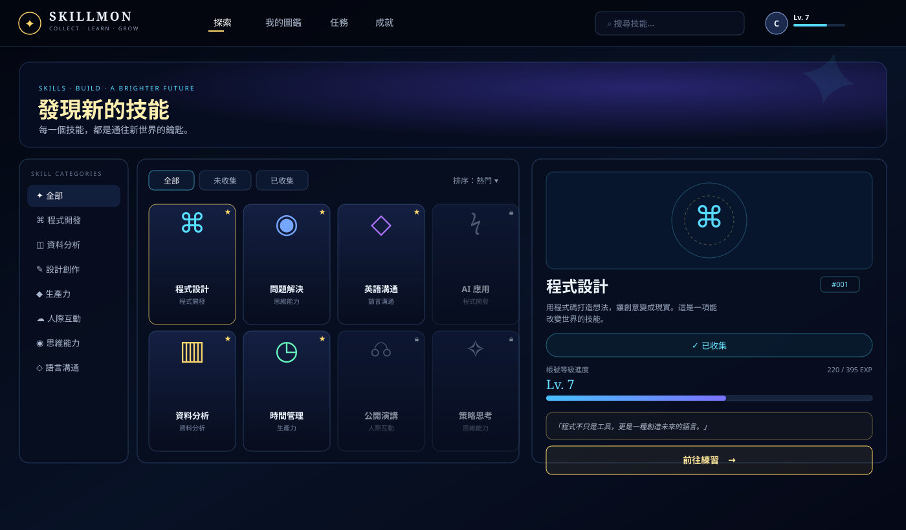

<div align="center">

# ✦ SkillMon

### 把「學習」變成一場你捨不得停下來的收集遊戲

**COLLECT · LEARN · GROW**

一個純前端、零框架、開箱即用的技能收集圖鑑 —— 登入、練習、升級、解鎖、成就，一次到位。

[](#)
[](#)
[](./LICENSE)
[](#-參與貢獻)
[](https://chi-hsienchang.github.io/SkillMon/)

### 🎮 [**點我立即體驗 → chi-hsienchang.github.io/SkillMon**](https://chi-hsienchang.github.io/SkillMon/)

> 👉 **第一次進來？** 不用註冊，直接在登入畫面點「**以訪客身分探索**」，就能馬上把所有功能玩過一輪（收集、練習升級、任務、成就都能體驗，只是訪客資料不會被保存）。想長期累積進度，再回來註冊一個帳號即可。

</div>

---

## 為什麼會有 SkillMon？

我們都列過「今年要學的技能清單」，然後三天後就忘了它存在。

問題不在於缺乳清單，而在於**清單沒有回饋感**。打勾一個項目，不會讓你升級；學完一項技能，也沒有人為你喝采。

SkillMon 把「自我成長」重新包裝成你熟悉的那種讓人上癮的遊戲迴圈：

> 收集技能卡 → 練習拿經驗值 → 升級拿技能點 → 用技能點解鎖新技能 → 完成任務拿更多獎勵 → 解鎖成就炫耀。

沒有課程、沒有影片、沒有訂閱制——**它就是一個誠實的進度視覺化工具**，讓「我正在學 XX」這件事變得看得見、玩得下去。

---

## 📸 畫面預覽


# 探索頁 —— 收集網格 + 技能詳情



> 開始玩？直接開 [線上 Demo](https://chi-hsienchang.github.io/SkillMon/) 最快。如果你想放上自己實際操作的截圖，也歡迎把 `docs/screenshot-login.svg`、`docs/screenshot-explore.svg` 換成你自己的 `docs/screenshot-*.png`，並額外補上任務頁、成就頁的截圖：
>
> ```
> docs/screenshot-quests.png       — 任務頁
> docs/screenshot-achievements.png — 成就頁
> ```

---

## ✨ 核心功能

### 🔐 會員系統
- **註冊 / 登入 / 登出**，帳號、密碼即時驗證（帳號需 2–16 字元、密碼至少 4 碼、密碼需二次確認）
- 密碼**先做 SHA-256 雜湊再儲存**，不會有任何地方存到明碼
- **訪客模式**：完全不用註冊就能立即體驗全部功能（資料不會保存，適合展示 / Demo）
- 個人選單即時顯示帳號、等級、技能點、收集數、累積練習次數

### 🧬 收集與成長系統
- 16 張技能卡，分為 程式開發 / 資料分析 / 設計創作 / 生產力 / 人際互動 / 思維能力 / 語言溝通 七大分類
- 每張卡都有獨立圖示、專屬配色、風味敘述與語錄
- **練習已收集技能** → 隨機獲得 15–30 經驗值，經驗值滿了自動升級，升級再獲得技能點
- **技能點可以拿來解鎖未收集的技能**（預設 5 點／張），讓「還沒學會的東西」變成明確的目標而不是模糊的清單

### 🗓️ 任務系統（每日 + 里程碑）
- 每日簽到、每日練習任務，**隔天自動重置**，養成天天回來的習慣
- 收集 5 / 10 / 全部技能、練習次數、等級門檻等**里程碑任務**，達成才能領取豐厚獎勵
- 任務未達成條件時按鈕自動鎖定，達成才會亮起「領取獎勵」

### 🏆 成就系統
- 6 種依真實進度**自動判定**解鎖的徽章（收藏家、技能學徒、圖鑑大師、練習狂、資深探索者⋯）
- 不用手動申請、不會有「明明達成了卻沒拿到」的體驗落差

### 🔎 探索體驗
- 分類側邊欄、已收集／未收集篩選、即時搜尋
- 「我的圖鑑」分頁自動只顯示已收集技能，方便回顧成果
- 手機／平板／桌機皆有對應版面（RWD 斷點：1100px、720px）

---

## 🧱 技術棧

**完全沒有建置流程。** 開啟即用，沒有 npm install、沒有 webpack、沒有框架依賴。

| 項目 | 使用技術 |
|---|---|
| 結構 / 樣式 / 邏輯 | 純 HTML5 + CSS3 + Vanilla JavaScript（單一檔案 `index.html`） |
| 字體 | Google Fonts：`Cinzel`（標題）、`Noto Sans TC`（內文） |
| 密碼安全 | `crypto.subtle`（瀏覽器原生 SHA-256），不支援時自動退回簡易雜湊 |
| 資料儲存 | 抽象化的儲存層：偵測到雲端儲存 API（例如在 Claude 等支援環境中）會自動使用跨裝置雲端儲存；一般瀏覽器環境則自動退回 `localStorage` |
| 相依套件 | **零。** 不需要任何第三方套件或後端伺服器 |

這代表你可以直接把 `index.html` 拖進瀏覽器打開，或部署到任何純靜態空間，都能立即完整運作。

---

## 📂 專案結構

```
skillmon/
├── index.html                    # 整個網站（HTML + CSS + JS 都在同一檔案，零建置）
├── README.md                     # 就是你正在看的這份文件
├── LICENSE                       # MIT 授權
└── docs/
    ├── screenshot-login.svg      # 登入畫面示意圖
    └── screenshot-explore.svg    # 探索頁示意圖
```

---

## ⚠️ 已知限制

這是一個**前端展示 / 個人專案等級**的帳號系統，適合作品集、教學示範、內部工具或原型驗證，但**還不是生產等級的正式會員系統**：

- 沒有真正的後端伺服器：一般瀏覽器環境下，帳號與進度資料只存在**你目前這個瀏覽器**的 `localStorage`，換瀏覽器、換裝置、清除瀏覽器資料都會遺失
- 密碼雖然有雜湊，但沒有加鹽強度審核、沒有速率限制、沒有忘記密碼流程，**不建議使用者輸入自己在其他服務也在用的真實密碼**
- 沒有 Email 驗證、沒有第三方登入（Google / GitHub OAuth 等）
- 若你把它跑在支援雲端鍵值儲存 API 的環境（例如 Claude 的 Artifact 執行環境）中，帳號資料會自動改用該環境提供的跨裝置雲端儲存——這時的資料是所有使用者共用可見的儲存空間，一樣不建議放入敏感資訊

如果你想把它升級成正式產品，可以參考下面的路線圖。

---

## 🗺️ 路線圖 / 歡迎認領的方向

- [ ] 接上真正的後端（Supabase / Firebase / 自架 API）取代 localStorage
- [ ] Email 驗證與忘記密碼流程
- [ ] 第三方登入（GitHub、Google）
- [ ] 更多技能卡與自訂技能樹（分支解鎖、前置技能）
- [ ] 排行榜（技能點 / 等級 / 收集數排名）
- [ ] 匯出／匯入個人進度（JSON 備份）
- [ ] 深色以外的主題色盤
- [ ] i18n 多語系（目前為繁體中文）

---

## 🤝 參與貢獻

歡迎任何形式的貢獻：回報 Bug、提出功能建議、送 PR。

1. Fork 這個 repository
2. 開一個新分支：`git checkout -b feature/你的功能名稱`
3. 提交變更：`git commit -m "✨ 新增：xxx"`
4. Push 到你的分支：`git push origin feature/你的功能名稱`
5. 開一個 Pull Request，簡述你改了什麼、為什麼

如果你只是想回報問題或提出想法，直接開 Issue 即可，不需要先寫程式碼。

---

## ❓ 常見問題 FAQ

**Q：我可以拿這個當作我的作品集專案嗎？**
可以，這正是它被設計的目的之一。建議依照下方 LICENSE 保留姓名標示，並歡迎在 README 加上你自己客製的部分說明你做了哪些延伸。

**Q：我把它放到 GitHub Pages 後，註冊的帳號別人看得到嗎？**
不會。部署到一般靜態空間（如 GitHub Pages）時，資料只存在**每個訪客自己瀏覽器的 localStorage**，彼此互不相通、也互看不到。

**Q：解鎖成本、經驗值曲線、任務內容可以改嗎？**
可以，全部都是 `index.html` 裡幾個好找的常數與陣列（`UNLOCK_COST`、`expNeeded()`、`questDefs`、`achievementDefs`、`skills`），改完存檔重新整理即可看到效果，不需要重新建置。

**Q：一定要用 Chrome 才能跑嗎？**
不用，任何支援 ES2017+（`async/await`）與 `crypto.subtle` 的現代瀏覽器都可以，包含 Chrome、Edge、Firefox、Safari 最新版本。

</div>
